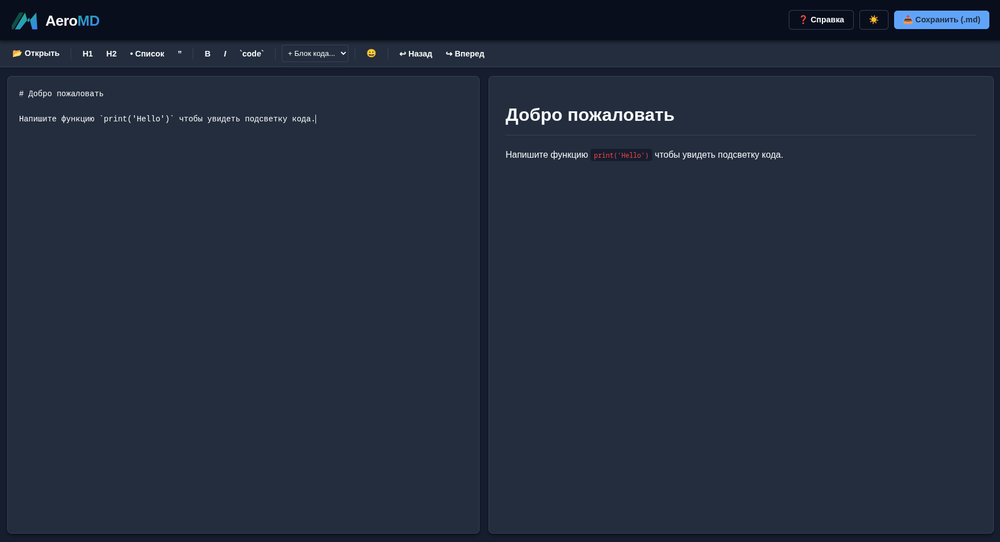
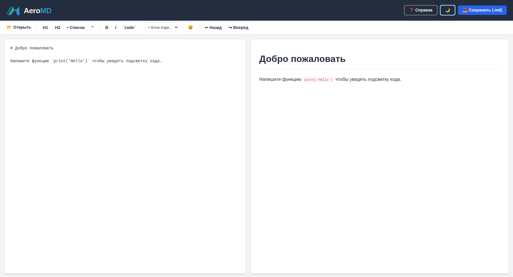

# ✈️ AeroMD

**AeroMD** — это быстрый, минималистичный и функциональный Markdown-редактор, разворачиваемый локально с помощью Docker. Он создан для тех, кому нужен удобный инструмент для написания документации, заметок или README-файлов без привязки к облачным сервисам.

Никаких регистраций и подписок. Вся работа происходит локально в вашем браузере, а изображения сохраняются на вашем жестком диске.

---

## ✨ Ключевые возможности

* ⚡ **Live Preview:** Мгновенный рендеринг Markdown в HTML по мере набора текста.
* 🎨 **Темы оформления:** Поддержка светлой и темной темы (выбор сохраняется в браузере).
* 🖼️ **Умная работа с изображениями:** Поддержка Drag & Drop и вставки из буфера обмена (`Ctrl+V`). Изображения автоматически загружаются в локальную директорию и вставляются в текст.
* 💻 **Подсветка синтаксиса:** Встроенная поддержка подсветки кода (в стиле VS Code) с помощью Highlight.js для множества языков программирования (Python, C++, JS, Bash и др.).
* ⏪ **Локальная история:** Собственный стек отмены/повтора действий (`Ctrl+Z` / `Ctrl+Y`).
* 📂 **Работа с файлами:** Открытие локальных `.md` файлов и сохранение результатов на компьютер в один клик.
* 😀 **Emoji Picker:** Встроенная панель выбора эмодзи.
* 🛠️ **Панель инструментов:** Удобные кнопки для быстрого форматирования (заголовки, списки, цитаты, жирный текст) с умной вставкой в начало строки.

---

## 🚀 Быстрый старт (Установка)

Проект упакован в легковесный Docker-контейнер, поэтому для запуска вам понадобится только установленный [Docker](https://www.docker.com/) и Docker Compose.

**1. Клонируйте репозиторий:**
```bash
git clone https://github.com/snax1k/Snax1k-md.git
cd aeromd
```

**2. Запустите контейнер:**
```
docker compose up -d
```

**3. Откройте приложение:**
Перейдите в браузере по адресу: http://localhost:5000

**Примечание: Все загруженные вами изображения будут физически сохраняться в папке ./data/uploads рядом с файлом docker-compose.yml.**

---

## ⌨️ Горячие клавиши
- `Ctrl + S` - Скачать готовый .md файл на компьютер
- `Ctrl + Z` - Отменить последнее действие (Undo)
- `Ctrl + Y` - Повторить отмененное действие (Redo)
- `Tab` - Вставить отступ (2 пробела)
- `Ctrl + V` - Вставить изображение из буфера обмена

## 🛠️ Стек технологий
- **Backend:** Python 3.11, Flask (обработка загрузки изображений и отдача статики)
- **Frontend:** HTML5, CSS3 (Custom Properties), Vanilla JavaScript
- **Парсер Markdown:** marked.js
- **Подсветка кода:** Highlight.js
- **Инфраструктура:** Docker, Docker Compose

## 📝 Структура проекта

```html
aeromd/
├── docker-compose.yml      # Конфигурация запуска
├── Dockerfile              # Сборка образа
├── requirements.txt        # Зависимости Python
├── app.py                  # Легкий бэкенд на Flask
├── templates/
│   └── index.html          # Frontend приложения
└── data/                   # (Создается автоматически) Папка для данных
    ├── document.md         # Резервный файл
    └── uploads/            # Папка для загруженных изображений
```

## 🤝 Вклад в проект (Contributing)

Pull requests приветствуются! Если вы нашли ошибку или хотите предложить новую функцию:

- Сделайте Fork проекта

- Создайте свою ветку (`git checkout -b feature/AmazingFeature`)

- Зафиксируйте изменения (`git commit -m 'Add some AmazingFeature`)

- Отправьте ветку (`git push origin feature/AmazingFeature`)

- Откройте Pull Request

## 📷️ Скришоты



## 📄 Лицензия
Распространяется под лицензией MIT. Подробности см. в файле [LICENSE](https://github.com/snax1k/Snax1k-md/blob/main/LICENSE).
